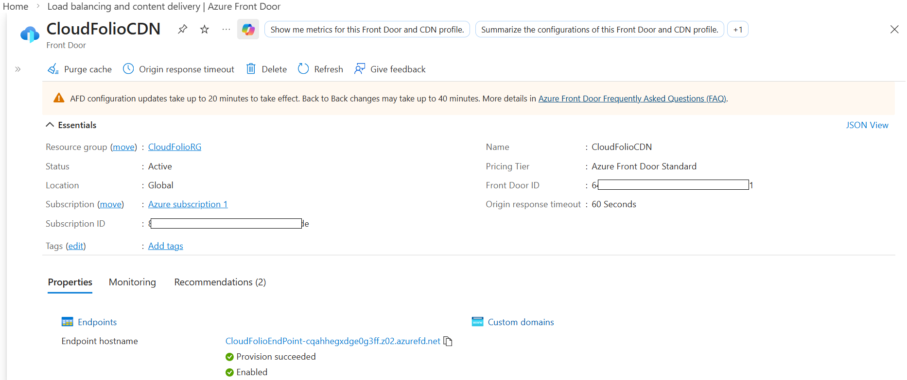
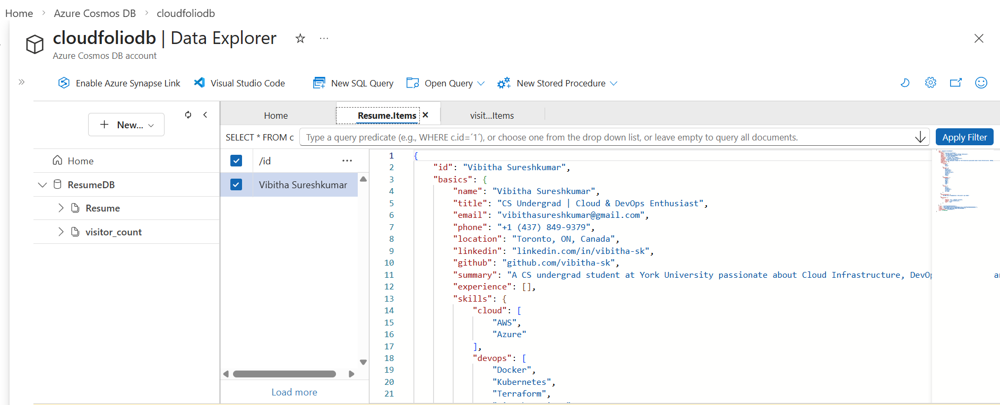
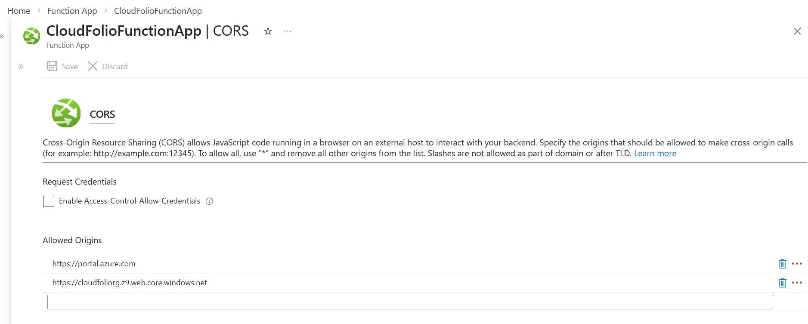
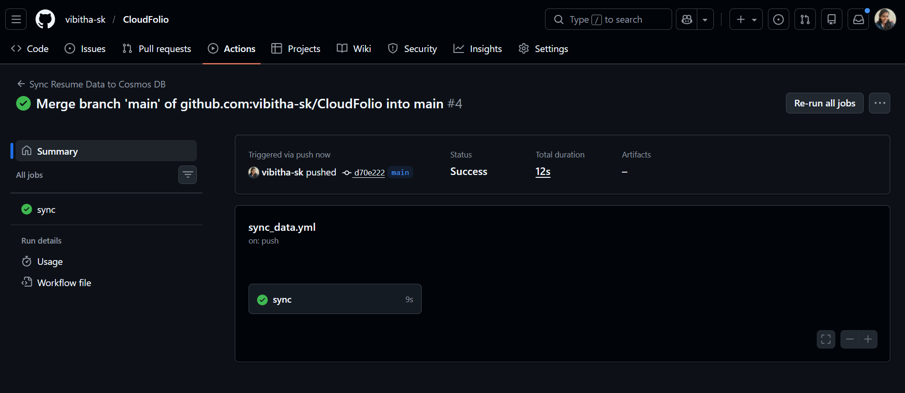

# CloudFolio
> A simple serverless API built with Azure Functions.

### 📌Overview
This project is a demonstration of a simple serverless API architecture on Azure, where a static website fetches and displays data 
stored in Cosmos DB through an Azure Function, with CI/CD automated by GitHub Actions for infrastructure provisioning and data updates.

### 🎯Use Case
The data used in this project represents a personal resume. Whenever the data is updated, GitHub Actions automatically syncs 
it to Cosmos DB, and the website reflects the changes instantly.

### 🏗️Setup Architecture

### ⚙️ How It Works
*FRONTEND*
- **Users** —  access the static website served via Azure CDN.
- **Storage Account** — serves the hosted static website to the users.

*BACKEND*
- **HTTP GET** — request sent to the Azure Function API by the browser to get the data.
- **Function** —  fetches the data from Cosmos DB.
- **Cosmos DB** — returns the data to the Function which returns the JSON response back to the browser.

### 🎥Demonstration
*Users can access the website using the CDN endpoint*

*Live resume API website served via Azure CDN*

*Resume data stored as JSON documents in Cosmos DB*

*CORS configured to allow requests from the CDN origin*

*GitHub Actions CI/CD pipeline successfully deployed*

### 🛠️Technologies Used
- Languages — Python
- Cloud Services — Azure Functions, Azure CosmosDB
- Automation Tool  — GitHub Actions
- Development Tools — VS Code, Azure Functions Core Tools

### 📚 Key Learnings
*Serverless API Development*
- Built and deployed a Python-based Azure Function as a serverless HTTP API endpoint.
- Securely managed credentials using environment variables and Azure Application Settings.

*Automation & CI/CD*
- Set up trigger-based pipelines that deploy upon every code push.
- Implemented a data sync workflow that watches for JSON file changes and automatically updates Cosmos DB.

